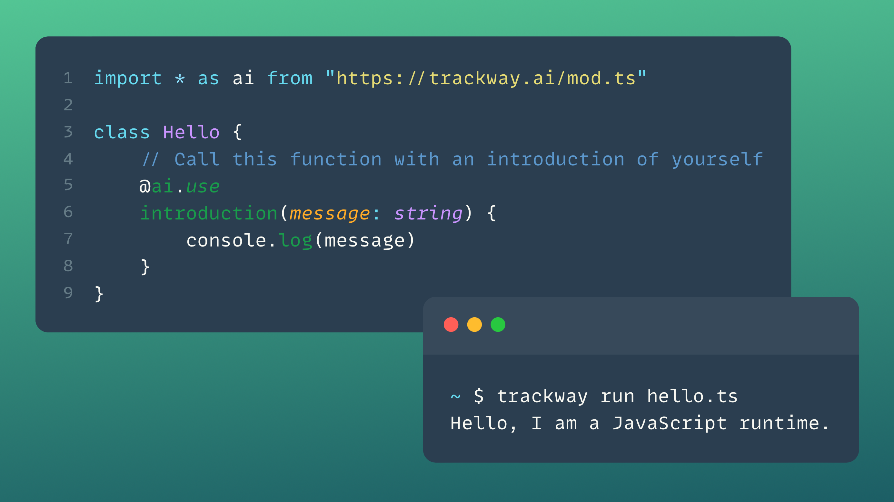

<div align="center">

</div>

<p align="center">
  
</p>

<h2 align="center">
  Let your code chat with LLMs
</h2>

<br/>

<p align="center">
<b>Trackway is a framework that lets LLMs understand how to use your code.</b> It statically generates context-efficient
prompts to help you build the most natural interfaces with language models.
</p>

<br/>

<p align="center">
  <a href="examples/hello.ts"></a>
</p>

<br/>

> [!WARNING]
> Trackway is a very early stage project. Expect APIs to change and features to break as we make our way to 1.0.

<br/>

- [Getting Started](#runner-getting-started)
    - [Installation](#installation)
    - [Hello, world!](#hello-im-a-javascript-runtime)
    - [Type is context](#type-is-context)
- [Examples](#rocket-examples)
    - [Data from text](#data-from-text)
    - [Chatbots](#chatbots)
    - [Automate stuff](#automate-stuff)
- [Documentation](#books-documentation)
    - [Building agents](#building-agents)
        - [Imports](#imports)
        - [Classes](#classes)
        - [Exports](#exports)
    - [Event loop](#event-loop)
        - [`Exit`](#aiexit)
        - [`Interrupt`](#aiinterrupt)
        - [`Feedback`](#aifeedback)
        - [Any other exception](#any-other-exception)
- [FAQ](#faq)
- [Contributing](#contributing)

## :runner: Getting Started

### Installation

Install the CLI

```bash
curl -fsSL https://trackway.ai/install.sh | sh
```

set your OpenAI API key

```bash
trackway config openai.key MY_SECRET_KEY
```

and run your first example

```bash
trackway run https://trackway.ai/examples/hello.ts
```

### Hello, I'm a JavaScript runtime.

Create a file `hello.ts` and lay down the skeleton of a class:

```typescript
import * as ai from "https://trackway.ai/mod.ts"

class Hello {
    // Call this function with an introduction of yourself
    @ai.use
    hello(message: string) {
        console.log(message)
        throw new ai.Exit()
    }
}

export default () => new Hello()
```

Note the `@ai.use` decorator: this is the key to exposing the hello method to the LLM backend.

Now run the agent:

```bash
$ trackway run hello.ts
Hello, I am a JavaScript runtime.
```

Under the hood, Trackway has statically generated a prompt set that includes the type signature of the `hello`
function. It then sends sections of that prompt set to the LLM, which uses it to generate a completion that will call
the function with the argument `"Hello, I'm a JavaScript program."`.

We can get a bit more insight into which function was called, and for what reason, by tuning up the log level:

```bash
trackway run --trace hello.ts
```

This will display a trace log of actions taken by the LLM. Like many other tools, Trackway asks the LLM backend to
justify the reasoning behind an action choice - and that reasoning is displayed in dimmed text above each action.

### Type is context

Because the LLM knows the type signature of the `hello` function, we can use the type system to our advantage. Let's
change the example a bit:

```typescript
import * as ai from "https://trackway.ai/mod.ts"

class Hello {
    // Call this function with how you feel today
    @ai.use
    hello(message: "happy" | "neutral" | "sad") {
        console.log(`I am feeling ${message} today.`)
        throw new ai.Exit()
    }
}

export default () => new Hello()
```

and run it again:

```bash
$ trackway run hello.ts
I am feeling happy today.
```

We can also use custom types to document even more context:

```typescript
import * as ai from "https://trackway.ai/mod.ts"

type Feeling = {
    // How do you feel?
    state: "happy" | "neutral" | "sad"

    // Why do you feel this way?
    reason: string
}

class Hello {
    // Call this function saying you're happy to learn about Trackway.
    @ai.use
    hello({state, reason}: Feeling) {
        console.log(`I am feeling ${state} today, because ${reason}`)
        throw new ai.Exit()
    }
}

export default () => new Hello()
```

Trackway automatically adds type declarations (here, the `Feeling` type) to the internal prompt set.

```bash
$ trackway run hello.ts
I am feeling happy today, because I am excited to learn about Trackway!
```

### Great! What now?

Now that you got a sense for how Trackway works, check out the examples below and start building your own!

## :rocket: Examples

### Data from text

Since the type system is used to generate prompts, you can use the underlying LLM to extract data from real-world noisy
text data.

For example, [extract.ts](./examples/extract.ts) takes a string argument and extracts some info from it:

```bash
trackway run https://trackway.ai/examples/extract.ts -- "I am 25 years old and I live in Paris"
```

### Chatbots

You can use Trackway to build interactive chatbots that can leverage Deno's ecosystem of libraries to pack awesome functionality into your agents.

To get you started, take a look at [chat.ts](./examples/chat.ts):

```bash
trackway run https://trackway.ai/examples/chat.ts
```

### Automate stuff

You can use Trackway to script agents that automate things for you.

For example, [fix.ts](./examples/fix.ts) is a small utility that will take a command and help you with getting what
you want with it:

```bash
trackway run https://trackway.ai/examples/fix.ts -- egrep -e "???" MyFile.txt 
```

Another example is [summarise.ts](./examples/summarise.ts), which will take a GitHub repository, pull its README.md
and summarise it with the info you want:

```bash
trackway run https://trackway.ai/examples/summarise.ts -- brokad/trackway
```

## :books: Documentation

### Building agents

#### Imports

Thanks to Deno's module loader, which supports importing from URLs, you only need one import to get started. Add this to
your agent modules:

```typescript
import * as ai from "https://trackway.ai/mod.ts"
```

This tracks the latest release. If you need a specific version, use:

```typescript
import * as ai from "https://trackway.ai/@0.1.0/mod.ts"
```

#### Classes

Any class can become an agent. Just make sure you decorate at least one of its methods with `@ai.use`:

```typescript
class MyAgent {
    @ai.use
    myMethod() {
        // ...
    }
}
```

> [!IMPORTANT]
> The LLM backend does not know of any other method than the ones you decorate with `@ai.use`.

#### Exports

Agent modules must have a default export that is a callable and returns an instance of your agent.

```typescript
export default () => new MyAgent()
```

This function can accept an argument of type [AgentOptions]() to extract command line arguments:

```typescript
export default ({argv}: AgentOptions) => {
    // do something with argv
    return new MyAgent()
}
```

### Event loop

When you run an agent with `trackway run`, the runtime will enter an event loop. It will keep bouncing back and forth
between your agent and the LLM backend. In other words: your class goes on autopilot.

There are exceptions you can throw to control that event loop:

#### `ai.Exit`

This exception will be unwound, stop the event loop and exit the runtime.

```typescript
class MyAgent {
    @ai.use
    myMethod() {
        // Exit the event loop, and the runtime
        throw new ai.Exit()
    }
}
```

#### `ai.Interrupt`

This exception will be unwound and the inner `Error` will be rethrown.

```typescript
class MyAgent {
    @ai.use
    async readFile(path: string) {
        try {
            return await Deno.readTextFile(path)
        } catch (e) {
            // Exit the event loop, rethrowing the error
            throw new ai.Interrupt(e)
        }
    }
}
```

#### `ai.Feedback`

This exception will be unwound and repackaged as
a [system message](https://platform.openai.com/docs/api-reference/chat/create) to the LLM backend. You can use it to
bounce back information to the LLM, which is especially useful on validating inputs it gives you:

```typescript
class MyAgent {
    @ai.use
    howOldAreYou(age: number) {
        // Send a system message to the LLM backend
        if (age < 0) throw new ai.Feedback("age cannot be negative")
    }
}
```

#### Any other exception

If a method called by the LLM backend throws an exception and that exception is not one of the exceptions above, then
that exception will be repackaged as a system message and sent back to the LLM.

## FAQ

### How safe is it?

Trackway lets an LLM decide what action to take next. And since LLMs are large and complicated models, it is difficult
to guarantee agents are safe against adversarial user inputs.

At the level of Trackway, there are a few implemented backstops that can help.

One of them is that we **never** execute code coming directly from the LLM backend. We have a pure JSON-only interface
with the LLM,
asking it for data and returning it data. So the model is unable to have side effects that you didn't expose through the
content of your own code.

Another backstop is that *only* methods that are explicitly tagged with the [@use](#building-agents) annotation are
exposed to the
LLM. Therefore, only those methods are known to the model. Even the method's body is hidden from the model! So it only
knows of the public interface: the method name, its documentation, the method's arguments, the type declarations of
those arguments, etc. Basically it knows what you would otherwise know reading through a documentation page.

That being said, if security is a concern, you should always validate untrusted inputs and carefully consider the side
effects your agent can produce.

TL;DR: If you're dealing with untrusted user input, apply the same caution as you would when implementing any
public-facing API.

## Contributing

Trackway is 100% a community effort to make LLM chains easy to build and use. And I'm so grateful you're willing to
help!

If you have found a bug or have a suggestion for a feature you'd like, open
an [issue](https://github.com/brokad/trackway/issues/new). PRs are of course always
welcome!

If you have a question to ask or feedback to give, be it good or bad, please start
a [discussion](https://github.com/brokad/trackway/discussions/new?category=ideas).

If you feel like helping with the implementation, get in touch!

[LangChain]: https://python.langchain.com/docs/get_started/introduction.html

[LlamaIndex]: https://gpt-index.readthedocs.io/en/latest/

[marvin]: https://github.com/PrefectHQ/marvin
