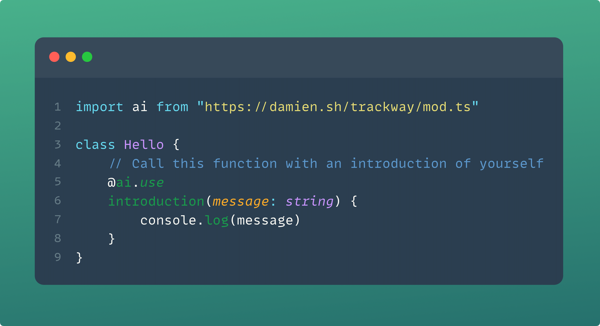

<div align="center">

</div>

<p align="center">
  
</p>

<h2 align="center">
  TypeScript :heart: LLMs
</h2>

<br/>

Trackway is a prompt-generation framework that lets you **export TypeScript code, so that it can be consumed by an LLM
runtime**. All you need are a few annotations and well-documented functions, and you can script agents out of anything
and have them run anywhere.

<br/>

<p align="center">
  <a href="./examples/hello-world.ts"></a>
</p>

<br/>

> [!WARNING]
> Trackway is a very early stage project. Expect APIs to change and features to break as we make our way to 1.0.

<br/>

- [Getting Started](#getting-started)
    - [Run the examples](#run-the-examples)
    - [Install Deno](#install-deno)
    - [Get an OpenAI key](#get-an-openai-key)
- [Examples](#examples)
    - [Hello, World!](./examples/hello-world.ts)
    - [Hello, World! (interactive)](./examples/hello-world-interactive.ts)
    - [Extracting information](./examples/extract-feedback.ts)
- [Documentation](#documentation)
    - [Imports](#imports)
    - [Building agents](#building-agents)
    - [@prompts](#prompts)
    - [@use](#use)
    - [call: calling one function](#call-calling-one-function)
    - [Exceptions](#exceptions)
- [FAQ](#faq)
- [Roadmap](#roadmap)
- [Contributing](#contributing)

## Getting Started

### 1. OpenAI API

Trackway uses OpenAI's chat completion API as the only currently supported LLM provider. You will need the key available
under the OPENAI_KEY environment variable:

```bash
$ export OPENAI_KEY="TOP SECRET KEY"
```

If you want to know exactly what gets sent to OpenAI (i.e. what gets embedded in the prompts), take a look
at [FAQ: How safe is it?](#how-safe-is-it).

### 2. Deno

Trackway is built for [Deno](https://deno.land). Make sure you have it installed, otherwise follow
the [official installation guide](https://deno.land/manual@v1.36.1/getting_started/installation).

### 3. First steps

Create a file `hello.ts` and lay down the skeleton of a class:

```typescript
class Hello {
    introduction(message: string) {
        console.log(`introduction: ${message}`)
    }
}
```

We're going to ask an LLM to call this function with a nice introduction message. Add the following import and decorate
the `introduction` function:

```diff typescript
+ import ai from "https://damien.sh/trackway/mod.ts"

class Hello {
+ // Call this function with an introduction of yourself
+ @ai.use
  introduction(message: string) {
    console.log(`introduction: ${message}`)
    + throw new ai.Exit()
  }
}

+ await ai.run(new Hello())
```

Then run the script:

```bash
$ deno run hello.ts
Hello, I am a JavaScript runtime.
```

If this is the first time you're running the command, you will get prompted to install a [Rust companion binary](./tc).

In order to understand a bit better what's happening under the hood, let's tune up the log level:

```diff typescript
import ai from "https://damien.sh/trackway/mod.ts"

class Hello {
  // Call this function with an introduction of yourself
  @ai.use
  introduction(message: string) {
    console.log(`introduction: ${message}`)
    throw new ai.Exit()
  }
}

+ ai.setLogLevel("trace")
+
await ai.run(new Hello())
```

and run it again (this time with `-A` so we don't get prompted for permissions):

```bash
$ deno run -A hello.ts
trace:       The code has a function called introduction and it accepts a message parameter. Since the prompt asks to 
           ╭ call this function with an introduction of myself, I will call it with a message
trace:  call introduction("Hello, I am a JavaScript program.")
Hello, I am a JavaScript program.
trace:  exit null
```

Trackway packages the signature of the functions you tag with `@ai.use` and ships them as context for the LLM backend.
When we call `ai.run(...)`, we kickstart an event loop which asks the backend which function they want to call, call 
the function for them, and return the output. Except that, in this case, we don't return them anything: an `ai.Exit()` 
exception is thrown, which terminates the event loop early.

## Examples

### Hello, World!

### Hello, World! v2

### String to Type

### I/O

## FAQ

### What is this? And what is it *not*?

Trackway aims to be a pure prompt-generation and runtime interface that parses, filters and processes code to
create a
LLM-friendly runtime.

This means the starting and end points are always code. In this project, prompt engineering is closer to a code
generation task: something you can customise and adjust procedurally (like any meta-programming framework), but not
something you'd do manually.

If you need something that is low-level where prompts are crafted through raw string concatenation or interpolation, you
might want to
look at [LangChain] or [LlamaIndex] instead. Trackway is a project closer to something like [marvin].

### How safe is it?

Trackway lets an LLM decide what action to take next. And since LLMs are large and complicated models, it is difficult
to guarantee agents are safe against adversarial user inputs.

At the level of Trackway, there are a few implemented backstops that can help.

One of them is that we *never* execute code coming directly from the LLM backend. We have a pure JSON-only interface
with the LLM,
asking it for data and returning it data. So the model is unable to have side effects that you didn't expose through the
content of your own code.

Another backstop is that *only* methods that are explicitly tagged with the [@use annotation](#use) are exposed to the
LLM. Therefore only those methods are known to the model. Even the method's body is hidden from the model! So it only
knows of the public interface: the method name, its documentation, the method's arguments, the type declarations of
those arguments, etc. Basically it knows what you would otherwise know reading through a documentation page.

That being said, if security is a concern, you should always validate untrusted inputs and carefully consider the side
effects your agent can produce.

TL;DR: If you're dealing with untrusted user input, apply the same caution as you would when implementing any
public-facing API.

## Contributing

Trackway is 100% a community effort to make LLM chains easy to build and use. And I'm so grateful you're willing to
help!

If you have found a bug or have a suggestion for a feature you'd like, open
an [issue](https://github.com/brokad/trackway/issues/new). PRs are of course always
welcome!

If you have a question to ask or feedback to give, be it good or bad, please start
a [discussion](https://github.com/brokad/trackway/discussions/new?category=ideas).

If you feel like helping with the implementation, get in touch!

[LangChain]: https://python.langchain.com/docs/get_started/introduction.html

[LlamaIndex]: https://gpt-index.readthedocs.io/en/latest/

[marvin]: https://github.com/PrefectHQ/marvin
