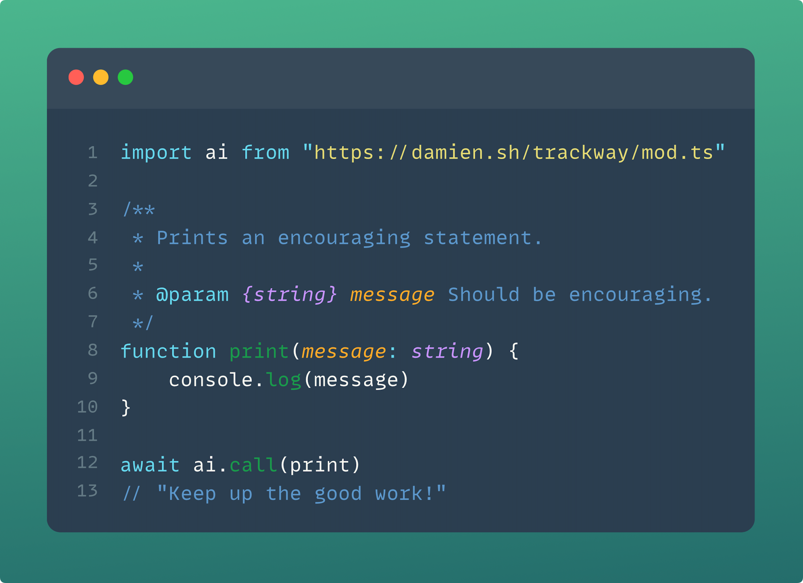

<div align="center">

</div>

<p align="center">
  
</p>

<h2 align="center">
  TypeScript :heart: LLMs
</h2>

<br/>

Trackway is a prompt-generation framework that lets you **export TypeScript code, so that it can be consumed by an LLM
runtime**. All you need are a few annotations and well-documented functions, and you can script agents out of anything
and have them run anywhere.

<br/>

<p align="center">
  <a href="./examples/be-encouraging.ts"></a>
</p>

<br/>

> [!WARNING]
> Trackway is a very early stage project. Expect APIs to change and features to break as we make our way to 1.0.

<br/>

- [Getting Started](#getting-started)
    - [Run the examples](#run-the-examples)
    - [Install Deno](#install-deno)
    - [Get an OpenAI key](#get-an-openai-key)
- [Examples](#examples)
    - [Hello, World!](./examples/hello-world.ts)
    - [Hello, World! (interactive)](./examples/hello-world-interactive.ts)
    - [Extracting information](./examples/extract-feedback.ts)
- [Documentation](#documentation)
    - [Imports](#imports)
    - [Building agents](#building-agents)
    - [@prompts](#prompts)
    - [@use](#use)
    - [call: calling one function](#call-calling-one-function)
    - [Exceptions](#exceptions)
- [FAQ](#faq)
- [Roadmap](#roadmap)
- [Contributing](#contributing)

## Getting Started

If you already have Deno and an OpenAI key, you can try out the [examples](./examples) interactively by running:

```bash
deno run https://damien.sh/trackway/examples/mod.ts
```

If you want to try just one specific example out, replace "mod.ts" by the example file (e.g. "hello-world.ts").

See [Install Deno](#install-deno) and [Get an OpenAI key](#get-an-openai-key) if you need to set those up. Otherwise,
head over to the [docs](#documentation) to learn how to build your own agents!

#### Install Deno

Trackway runs on the [Deno](https://deno.land) runtime. Deno is a single binary executable with no external dependencies
and can be
installed quickly on macOS/Linux:

```bash
curl -fsSL https://deno.land/x/install/install.sh | sh
```

or your package manager of choice. Refer to
the [official deno guide](https://deno.land/manual/getting_started/installation) for more.

#### Get an OpenAI key

Under the hood, Trackway needs an LLM provider. Currently only OpenAI's gpt-based with the ChatCompletion API
are supported, but other providers are on the roadmap.

Head on over to [platform.openai.com](https://platform.openai.com) to create an account and get an API key.

Trackway will use the `OPENAI_KEY` environment variable, so export it to your current shell session:

```bash
export OPENAI_KEY="my-super-secret-key"
```

Take a look at the [How safe is it?](#how-safe-is-it) section if you want to know what gets sent to OpenAI when you use
Trackway.

## Examples

See [examples](./examples).

## Documentation

### Getting Started

You only need one import (no install required):

```typescript
import ai from "https://damien.sh/trackway/mod.ts"
```

By default, this will always pull the latest release (recommended). If you need to peg a specific version, use a `@semver` tag:

```typescript
import ai from "https://damien.sh/trackway@0.1.0/mod.ts"
```

### Building agents

In order to build an agent, extend the `Agent` class:

```typescript
import ai from "https://damien.sh/trackway/mod.ts"

class MyAgent extends ai.Agent {
    // ...
}
```

This makes instances of the `MyAgent`
class [await](https://developer.mozilla.org/en-US/docs/Web/JavaScript/Reference/Operators/await)'able. Each await
statement passes control over to the LLM
and
awaits for completion of the task:

```typescript
// Create a new instance of MyAgent:
const myAgent = new MyAgent()

// Give control to the LLM and wait for the output:
const output = await myAgent
```

In order to complete the task, the `Agent.resolve` method must be called.

Typically, you'd want to call `Agent.resolve` from one of the methods you've exposed to the LLM. This way you create a
path for the LLM to complete the task autonomously:

```typescript
import ai from "https://damien.sh/trackway/mod.ts"

class BeEncouraging extends ai.Agent {
    @ai.use
    endImmediately(an_encouraging_statement: string) {
        this.resolve(an_encouraging_statement)
    }
}

console.log(await new BeEncouraging())

// prints: "You did a great job!"
```

See below for the [@use](#use) annotation, which makes a method available to the LLM runtime.

### @prompts

The `@prompts` decorator accepts one `string` argument. This should be the URL to the `.ts` file which contains the
source of the agent. The default is to use the main module (i.e. the module you are running with `deno run`) and you generally don't need to change it. 
If you need to override it, you'll generally want to use the [`import.meta` API](https://deno.land/manual/runtime/import_meta_api):

```typescript
import ai from "https://damien.sh/trackway/mod.ts"

@ai.prompts(import.meta.url)
class MyAgent extends ai.Agent {
    // ...
}
```

The decorator instantiates the prompts generator and points it at the given source file.

### @use

The `@use` decorator can be added to any method of [a class which extends `Agent`](#building-agents). **Only the methods
that
have the decorator are exposed to the LLM**. Other methods are unknown to the model, which helps with security (by
restricting information privilege) and helps to deal with restrictions on maximum context sizes.

### call: Calling one function

The `call` function is sugar for a basic input/output agent. It is useful for quick tasks related to transforming unstructured text
into structured data.

It takes as input a named function and an optional string to provide additional context to the model:

```typescript
import ai from "https://damien.sh/trackway/mod.ts"

type Poet = "shakespeare" | "dickinson" | "wordsworth" | "eliot"

/**
 * @param {Poet} poet The poet who wrote the input sentence
 */
function callback(poet: Poet) {
    console.log(poet)
}

await ai.call(callback, "Hope is the thing with feathers that perches in the soul.")

// prints: dickinson
```

You often need more control and multiple action paths (e.g. for handling malformed inputs or errors), in which case look at 
[Building agents](#building-agents). 

For example, rerunning the example above with a famous quote from [DJ Khaled](https://en.wikipedia.org/wiki/DJ_Khaled):

```typescript
// ... inputting a quote from DJ Khaled ...
await ai.call(callback, "Don't ever play yourself.")

// prints: shakespeare
```

will print "shakespeare"! 

It is often better to define an explicit agent with multiple methods as in [hello-world-interactive.ts](./examples/hello-world-interactive.ts)

### Exceptions

By default, any action taken by the LLM is wrapped up in a general `catch` clause. This means if a method called by the
LLM throws an exception, it is caught first by Trackway. The exception is then wrapped in a prompt and feedback is given
to the model, giving it a chance to correct its action. If the following action throws again, the exception is bubbled
up, and will reach the [`await` point](#building-agents).

Sometimes it is desirable, from @use methods, to throw exceptions that interrupt the agent altogether. For this, throw
the `Interrupt` exception:

```typescript
import ai from "https://damien.sh/trackway/mod.ts"

class HelloWorld extends ai.Agent {
    // ...

    /**
     * End the conversation early.
     *
     * If we're unable to determine which language the user prefers, end the conversation early.
     *
     * @param {string} reason A reason why the conversation was ended early.
     */
    @ai.use
    unable(reason: string) {
        throw new ai.Interrupt(reason)
    }
}
```

These exceptions are bubbled to the calling context without going through the feedback mechanism.

## FAQ

### What is this? And what is it *not*?

Trackway aims to be a pure prompt-generation and runtime interface that parses, filters and processes code to
create a
LLM-friendly runtime.

This means the starting and end points are always code. In this project, prompt engineering is closer to a code
generation task: something you can customise and adjust procedurally (like any meta-programming framework), but not
something you'd do manually.

If you need something that is low-level where prompts are crafted through raw string concatenation or interpolation, you
might want to
look at [LangChain] or [LlamaIndex] instead. Trackway is a project closer to something like [marvin].

### How safe is it?

Trackway lets an LLM decide what action to take next. And since LLMs are large and complicated models, it is difficult
to guarantee agents are safe against adversarial user inputs.

At the level of Trackway, there are a few implemented backstops that can help.

One of them is that we *never* execute code coming directly from the LLM backend. We have a pure JSON-only interface
with the LLM,
asking it for data and returning it data. So the model is unable to have side effects that you didn't expose through the
content of your own code.

Another backstop is that *only* methods that are explicitly tagged with the [@use annotation](#use) are exposed to the
LLM. Therefore only those methods are known to the model. Even the method's body is hidden from the model! So it only
knows of the public interface: the method name, its documentation, the method's arguments, the type declarations of
those arguments, etc. Basically it knows what you would otherwise know reading through a documentation page.

That being said, if security is a concern, you should always validate untrusted inputs and carefully consider the side
effects your agent can produce.

TL;DR: If you're dealing with untrusted user input, apply the same caution as you would when implementing any
public-facing API.

## Roadmap

TODO

## Contributing

Trackway is 100% a community effort to make LLM chains easy to build and use. And I'm so grateful you're willing to
help!

If you have found a bug or have a suggestion for a feature you'd like, open
an [issue](https://github.com/brokad/trackway/issues/new). PRs are of course always
welcome!

If you have a question to ask or feedback to give, be it good or bad, please start
a [discussion](https://github.com/brokad/trackway/discussions/new?category=ideas).

If you feel like helping with the implementation, get in touch!

[LangChain]: https://python.langchain.com/docs/get_started/introduction.html

[LlamaIndex]: https://gpt-index.readthedocs.io/en/latest/

[marvin]: https://github.com/PrefectHQ/marvin
